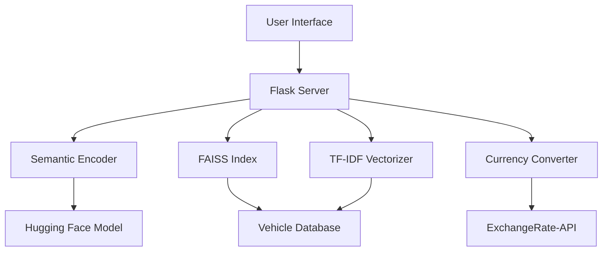

# AutoSearch Pro - Automotive Intelligence Search System

A intelligent search system for automotive vehicles with semantic search capabilities and real-time currency conversion.

## Features

- 🔍 Semantic vehicle search using both dense and sparse retrieval methods
- 💱 Real-time currency conversion (USD, EUR, GBP, INR)
- 🚀 Hybrid search combining TF-IDF and neural embeddings
- 📱 Responsive web interface with Bootstrap
- 🧠 Built with state-of-the-art NLP models (sentence-transformers/all-mpnet-base-v2)
- ⚡ FAISS-powered efficient similarity search

## Technologies Used

**Backend:**
- Python 3.8+
- Flask (Web framework)
- FAISS (Vector similarity search)
- Hugging Face Transformers
- scikit-learn (TF-IDF vectorization)
- pandas (Data handling)

**Frontend:**
- Bootstrap 5
- JavaScript (ES6)
- HTML5/CSS3

**Machine Learning:**
- Sentence Transformers
- Neural Semantic Encoding
- Hybrid Search Algorithm

## Dataset

The system uses the [Cars Dataset 2010-2020](https://www.kaggle.com/datasets/waqi786/cars-dataset-2010-2020) from Kaggle. The dataset contains:

- 50,000+ vehicle listings
- Features include Make, Model, Year, Price, Engine Specs
- Technical specifications and features
- North American market vehicles

## Installation

1. **Clone Repository**
```bash
git clone https://github.com/yourusername/automobile_search.git
cd automobile_search
```

2. **Install Dependencies**
```bash
pip install -r requirements.txt
```

3. **Download Dataset**
- Download dataset from [Kaggle](https://www.kaggle.com/datasets/waqi786/cars-dataset-2010-2020)
- Place `cars_2010_2020.csv` in project root

4. **Set Up Environment**
```bash
export FLASK_APP=app.py
export FLASK_ENV=development
```

5. **Install NLTK Dependencies**
```python
import nltk
nltk.download('punkt')
```

## Configuration

1. **Exchange Rate API**
- Get free API key from [ExchangeRate-API](https://www.exchangerate-api.com/)
- Replace in `app.py`:
```python
EXCHANGE_RATE_API_KEY = "your_api_key_here"
```

2. **Model Configuration**
- Default model: `sentence-transformers/all-mpnet-base-v2`
- To change model, modify `MODEL_NAME` in `information_retrieval.py`

## Usage

1. **Start Application**
```bash
flask run --host=0.0.0.0 --port=5000
```

2. **Access Web Interface**
- Open `http://localhost:5000` in browser

3. **Sample Queries**
- "Luxury SUV under $50k"
- "Hybrid cars with good mileage"
- "Sports cars with over 400 horsepower"
- "Family vehicles with high safety ratings"

4. **Currency Conversion**
- Use dropdown to select preferred currency
- Prices automatically convert using live rates

## API Endpoints

### `POST /search`
Vehicle search endpoint

**Request:**
```json
{
    "query": "SUV with good fuel economy"
}
```

**Response:**
```json
[
    {
        "car_id": 1234,
        "score": 0.872,
        "car_info": {
            "make": "Toyota",
            "model": "RAV4",
            "year": "2018",
            "price": "28500",
            ...
        }
    }
]
```

### `POST /convert`
Currency conversion endpoint

**Request:**
```json
{
    "amount": 25000,
    "currency": "EUR"
}
```

**Response:**
```json
{
    "converted_amount": 22875.50,
    "currency": "EUR"
}
```

## System Architecture



## License

MIT License - See [LICENSE](LICENSE) for details

## Acknowledgements

- Kaggle for the automotive dataset
- Hugging Face for pre-trained models
- FAISS team for efficient similarity search
- ExchangeRate-API for currency conversion
